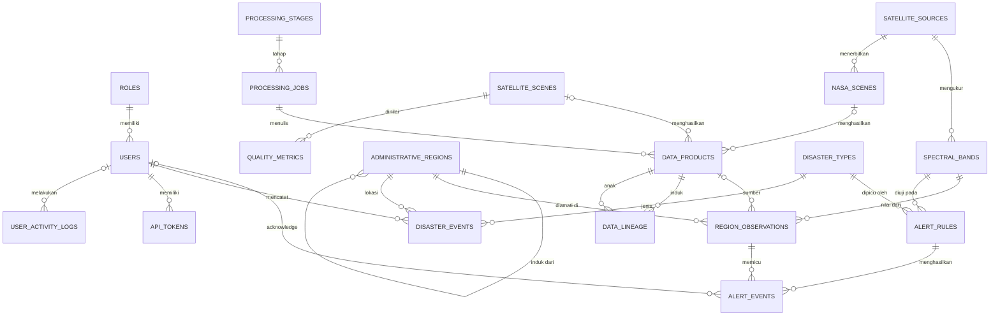

# DATABASE.md — Trinity: The Monitor

Rancangan basis data Trinity: The Monitor, ditulis ulang 8 Oktober 2026 dari kode yang berjalan:
`database/monitor_schema.sql`, `database/monitor_security.sql`, dan `database/monitor_seed.sql`.
Kalau dokumen ini berbeda dengan berkas SQL, **berkas SQL yang benar**. Dokumen ini yang diperbaiki,
lalu perubahannya dicatat di Decisions Log README §7.

Rincian per kolom (tipe, null, default, komentar) **tidak ditulis di sini**. Semuanya dibangkitkan dari
`COMMENT` di skema:

```
venv\Scripts\python tools\data_dictionary.py     # -> DOCS/generated/data_dictionary.md + erd_physical.mmd
```

Nomor bagian dokumen ini dirujuk langsung oleh kode, misalnya `DATABASE.md §8.3` di
`tests/security/grant_matrix.sql`. Jangan menomori ulang. Kalau perlu bagian baru, tambahkan di akhir.

## Peta DBSDLC → bagian

| Tahap DBSDLC (SKRIPSI.txt bagian A) | Bagian |
|---|---|
| Database Planning: mission statement & objective | §2.1, §2.2 |
| System Definition: batas sistem & user views | §2.3 |
| Requirement Collection and Analysis | §2.4 |
| Conceptual Database Design | §2.5–§2.7 |
| Logical Database Design | §5 |
| Physical Database Design: translasi, berkas & indeks | §3, §4, §6 |
| Physical: pandangan pengguna | §7 |
| Physical: mekanisme keamanan | §8 |
| Physical: redundansi terkendali | §9 |
| Physical: memantau & menyelaraskan | §6.4, §10 |
| DBMS Selection | §1 (rinci: PERBANDINGAN_DBMS.md) |
| Data Conversion and Loading (bagian basis data) | §10 (alur ETL: PIPELINE.md) |

---

## 1. DBMS Selection

Hasil lengkapnya ada di [PERBANDINGAN_DBMS.md](PERBANDINGAN_DBMS.md), dengan kode di `benchmark/`.

| Langkah | Isi |
|---|---|
| a. Kerangka acuan | Bobot kriteria: **spasial 30%**, **integritas 25%**, keamanan 15%, biaya 15%, integrasi 15% |
| b. Daftar pendek | PostgreSQL 18 + PostGIS dan MySQL 8.0 (alasan pemilihan: PERBANDINGAN_DBMS.md §1) |
| c. Evaluasi produk | Skema setara, data sintetis deterministik (`benchmark/generate.py`), kueri Q1–Q5 (`timing.csv`), uji fitur F1–F3 (`features.csv`) |
| d. Rekomendasi | **PostgreSQL + PostGIS** |

Penentunya bukan selisih milidetik. Ada tiga kebutuhan yang di MySQL tidak terpenuhi atau perlu disiasati:
kontrol akses per peran di dalam basis data (RM4), kueri spasial, dan kueri analitik ketika data membesar.

---

## 2. Perencanaan, Definisi Sistem, dan Desain Konseptual

### 2.1 Mission statement

> Basis data Trinity: The Monitor menyimpan data pengamatan tiga satelit (Sentinel-1, MODIS, GPM) dalam bentuk
> yang terstruktur per kecamatan, lengkap dengan asal-usul dan mutunya. Basis data ini juga mencatat peringatan
> hujan dan kejadian bencana, supaya Gugus Mitigasi Lebak Selatan (GMLS) dapat memantau kondisi
> hidrometeorologi wilayahnya, menilai ketepatan peringatan, dan membagikan data dengan hak akses yang jelas.

### 2.2 Mission objectives

Diturunkan dari rumusan masalah RM1–RM4 (README §6).

| # | Objective | RM | Tabel utama |
|---|---|---|---|
| MO1 | Mencatat setiap scene dan granule yang ditemukan atau diunduh dari tiga penyedia resmi | RM1 | `satellite_scenes`, `nasa_scenes` |
| MO2 | Menyimpan nilai harian per kecamatan per variabel sebagai satu deret waktu | RM1 | `region_observations` |
| MO3 | Mencatat setiap berkas keluaran beserta checksum dan transformasi asalnya | RM2 | `data_products`, `data_lineage`, `processing_jobs` |
| MO4 | Mengukur mutu data dan menandai data di bawah ambang | RM2 | `quality_metrics`, `quality_thresholds`, `quality_alerts` |
| MO5 | Membangkitkan peringatan ketika hujan melewati ambang BMKG, serta mencatat siapa yang menindaklanjuti | RM1, RM3 | `alert_rules`, `alert_events` |
| MO6 | Mengarsipkan kejadian bencana dan membandingkannya dengan peringatan (hit, miss, false alarm) | RM3 | `disaster_events`, `v_evaluasi_alert` |
| MO7 | Menyajikan data kepada lima peran sesuai batas aksesnya | RM3, RM4 | VIEW §7, GRANT §8.3 |
| MO8 | Mencatat siapa mengubah apa dan siapa mengunduh apa | RM4 | `audit_log`, `user_activity_logs` |

### 2.3 System definition

**Batas sistem.** Di dalam sistem: metadata scene/granule, nilai agregat per kecamatan, lineage, mutu,
peringatan, kejadian, laporan, akun, dan log. Di luar sistem:

- Piksel raster (COG, HDF5, PNG). Raster disimpan di filesystem `data/`, dan basis data hanya menyimpan path
  dan checksum-nya (README §4, "prinsip pemisahan").
- Data warga, KK, NIK, titik evakuasi, dan KRB. Data ini tetap di SIGAP DESA (README §2).
- Penyedia data (CDSE, LANCE/LAADS, GES DISC). Sistem hanya membaca dari penyedia.

**User views.** Lima peran (`roles`, seed M1):

| Peran | Label UI | Data yang dilihat | Data yang ditulis |
|---|---|---|---|
| PUBLIC | Pengunjung | Scene 30 hari, kejadian 365 hari, master rujukan | Log login gagal, registrasi akun USER |
| USER | Relawan | + scene 365 hari, hujan per kecamatan, alert aktif, seluruh riwayat kejadian | Token API milik sendiri, sandi sendiri |
| ANALYST | Analis | + semua scene, kejadian & hujan, evaluasi alert, Laporan Hidromet | Kejadian, acknowledge alert |
| DATA_ENGINEER | Data Engineer | + semua scene, dataset, lineage, mutu, Laporan Kesehatan Data | Dataset, ubah/nonaktifkan scene |
| ADMIN | Administrator | Semua | Akun, aturan, ambang, wilayah, pengaturan, Live Area |

Matriks rinci per halaman: INTERFACE.md §3. Penegakannya di basis data: §8.3.

### 2.4 Requirement collection and analysis

Teknik pencarian fakta yang dipakai sesuai metode di SKRIPSI.txt bagian B:

| Teknik | Sumber | Hasil yang masuk ke rancangan |
|---|---|---|
| Pemeriksaan dokumen | Ambang hujan BMKG; batas wilayah COD-AB (BPS/OCHA); spesifikasi produk ESA dan NASA | `alert_rules` (50/100/150 mm), `administrative_regions`, `spectral_bands.valid_min/max` |
| Penelitian | Kode dan skema Trinity: The DataLab (README §5) | Tabel warisan §4.1 |
| Wawancara / observasi | *[diisi penulis: tanggal, narasumber GMLS, ringkasan temuan]* | *[diisi penulis]* |

Bukti wawancara dan observasi (notulen, foto, surat) disimpan di `DOCS/lampiran/`. Baris ketiga belum bisa
diisi dari kode.

**5W1H sistem yang diusulkan:**

| | |
|---|---|
| What | Basis data monitoring hidrometeorologi dan arsip kejadian bencana |
| Who | GMLS: relawan (USER), analis, data engineer, administrator; masyarakat umum (PUBLIC) |
| When | Hidromet harian 02:00 WIB; siklus Live 01/07/13/19 WIB; laporan Senin 03:00 dan tanggal 1 03:30 WIB |
| Where | Kecamatan AOI GMLS di Kabupaten Lebak, Banten |
| Why | Hujan harian adalah indikator utama banjir dan longsor, sedangkan S1 hanya melintas tiap 6–12 hari. Data perlu satu tempat, terlacak, dan bisa dievaluasi terhadap kejadian nyata |
| How | ETL otomatis dari API resmi ke PostgreSQL/PostGIS; agregasi zonal per kecamatan; peringatan berbasis aturan; akses per peran ditegakkan GRANT dan RLS |

### 2.5 Entitas

38 tabel, dikelompokkan menurut perannya:

| Kelompok | Entitas |
|---|---|
| Master (12) + konfigurasi | `roles`, `users`, `satellite_sources`, `spectral_bands`, `administrative_regions`, `regions_of_interest`, `processing_stages`, `quality_thresholds`, `disaster_types`, `alert_rules`, `fusion_strategies`, `report_types`; `app_settings` |
| Akuisisi | `satellite_scenes`, `nasa_scenes` |
| Dataset & job | `datasets`, `dataset_source_config`, `dataset_jobs`, `scene_job_state`, `cleanup_operations` |
| Pemrosesan & lineage | `processing_jobs`, `processing_logs`, `data_products`, `data_lineage`, `fusion_products` |
| Mutu | `quality_metrics`, `quality_alerts` |
| Live | `live_areas`, `live_scenes`, `live_scene_metrics`, `live_events` |
| Observasi & peringatan | `region_observations`, `alert_events` |
| Forecast | `band_forecasts`, `band_forecast_points`, `band_forecast_scores` |
| Kejadian & laporan | `disaster_events`, `generated_reports` |
| Akses & jejak | `api_tokens`, `user_activity_logs`, `audit_log` |

Syarat prodi "master ≥ 10, transaksi ≥ 100 baris" dipenuhi oleh 12 tabel master. Jumlah baris transaksi
diambil dari `database/db_manifest.sql` (§10).

### 2.6 ERD konseptual (inti)

Hanya entitas yang menjawab RM1–RM4 yang digambar. ERD fisik lengkap (38 tabel) dibangkitkan sebagai
`DOCS/generated/erd_physical.mmd`.



### 2.7 Kunci dan domain

Semua tabel memakai **PK surrogate** (`SERIAL`/`BIGSERIAL`/`SMALLSERIAL`). Kunci alami dipertahankan sebagai
**alternate key** (`UNIQUE NOT NULL`), sehingga baris tetap bisa dikenali tanpa ID internal:

| Tabel | Candidate key yang tidak jadi PK (alternate key) |
|---|---|
| `roles` | `role_code`, `db_role` |
| `users` | `username`, `lower(email)` (indeks unik parsial) |
| `satellite_sources` | `source_code` |
| `spectral_bands` | `band_code` |
| `administrative_regions` | `pcode` (P-code COD-AB) |
| `satellite_scenes` | `product_identifier` (ID produk ESA), `scene_uuid` |
| `nasa_scenes` | (`source`, `tile_id`, `product_short_name`, `acquisition_date`) |
| `region_observations` | (`region_id`, `band_id`, `obs_date`) |
| `alert_events` | (`rule_id`, `region_id`, `observation_date`) |
| `band_forecasts` | (`band_id`, `COALESCE(region_id, 0)`, `data_stamp`) (indeks unik ekspresi; `region_id` NULL = rerata AOI) |
| `data_lineage` | (`parent_product_id`, `child_product_id`) |
| `api_tokens` | `token_prefix` |

Domain atribut ditegakkan dengan `CHECK` dan tipe ENUM (§5.3, §6.2). Rentang nilai fisik per band
(`spectral_bands.valid_min/max`) ditegakkan trigger `trg_obs_range`.

---

## 3. Tabel Master

Nomor 3.1–3.12 sama dengan label M1–M12 di skema dan seed. Isi seed ada di `monitor_seed.sql`.

### 3.1 `roles`
Lima peran aplikasi. Setiap peran dipetakan ke satu role PostgreSQL (`db_role`), yang dipakai lewat
`SET LOCAL ROLE` (§8.1).

### 3.2 `users`
Akun login, dari USER sampai ADMIN. Akun tidak pernah dihapus, hanya dinonaktifkan (`is_active`).
Trigger `trg_users_role_not_public` menolak akun ber-peran PUBLIC. Kolom penguncian (`failed_login_count`,
`locked_until`) dijelaskan di §8.6.

### 3.3 `satellite_sources`
SENTINEL1, MODIS, GPM, dan FUSION (turunan). Kolom `source` berjenis VARCHAR di tabel warisan dihubungkan ke
`source_code` lewat FK `ON UPDATE CASCADE`.

### 3.4 `spectral_bands`
Sebelas variabel yang diamati: VV, VH, WATER_PCT, WATER_CHANGE (S1); FLOOD, NDVI, NDWI (MODIS); RAIN_24H,
RAIN_72H, RAIN_7D, RAIN_30D (GPM). `aggregation` menentukan cara agregasi zonal: `MEAN` atau `FRACTION`.
`valid_min/max` adalah **batas fisik**, bukan batas "wajar". Tujuannya menolak nilai rusak (satuan salah,
NoData bocor), bukan menolak hujan ekstrem yang sah. Contohnya, batas hujan diambil dari rekor dunia WMO.

### 3.5 `administrative_regions`
Kabupaten Lebak (level 2) dan kecamatannya (level 3) dari COD-AB. `in_aoi = true` menandai kecamatan cakupan
GMLS, dan hanya boleh untuk level 3. `area_km2` adalah kolom GENERATED (§9). Desa tidak ada di COD-AB versi
terbaru, jadi desa hanya disimpan sebagai teks di `disaster_events.village_name`.

### 3.6 `regions_of_interest`
Bbox AOI warisan DataLab, dipakai untuk pencarian scene dan crop. Baris baru hanya boleh berasal dari
kecamatan atau gabungan kecamatan (M27). Wilayah buatan pengguna dan geocoding sudah dihapus, jadi nama yang
tidak dikenal dianggap kesalahan input. Hanya satu baris yang boleh ber-`is_monitor_aoi` (indeks unik parsial
`uq_roi_monitor_aoi`). Penghapusan memakai soft delete (`deleted_at`).

### 3.7 `processing_stages`
Tiga belas tahap: sembilan warisan (DOWNLOAD … PREVIEW) dan empat tahap Monitor (HYDROMET_AGGREGATE,
ALERT_CHECK, WATER_CHANGE, REPORT_BUILD). `stage_order` hanya urutan pendaftaran. Urutan eksekusi
sebenarnya ditentukan orchestrator.

### 3.8 `quality_thresholds`
Ambang kontrol mutu per band per metrik, menggantikan `processing_rules` DataLab. Ambang ini dibaca dari
tabel, bukan dari konstanta kode (`module5_orchestrator`, `module6_analytics`). Nilai seed:

| Band | Metrik | Warning di bawah | Fail di bawah |
|---|---|---|---|
| VV, VH | `quality_score` | — | 60 |
| FLOOD, NDVI, NDWI, RAIN_* | `valid_fraction` | 0,5 | 0,1 |

Bobot skor 50/30/20 tetap berupa konstanta kode. `CHECK` memastikan `fail_below ≤ warn_below` dan
`fail_above ≥ warn_above`.

### 3.9 `disaster_types`
BANJIR, BANJIR_BANDANG, LONGSOR, KEKERINGAN. ADMIN bisa menambah jenis tanpa mengubah kode. Ini dipakai
sebagai uji *adaptability*.

### 3.10 `alert_rules`
| Aturan | Band | Ambang | Severity | Aktif |
|---|---|---|---|---|
| FLOOD_RAIN24_HEAVY | RAIN_24H | ≥ 50 mm | INFO | ya |
| FLOOD_RAIN24_VHEAVY | RAIN_24H | ≥ 100 mm | WARNING | ya |
| FLOOD_RAIN24_EXTREME | RAIN_24H | ≥ 150 mm | CRITICAL | ya |
| LANDSLIDE_RAIN72 | RAIN_72H | (kosong) | WARNING | tidak |

`chk_rule_active_needs_threshold`: aturan hanya boleh aktif kalau ambangnya terisi. Karena itu aturan
longsor menunggu ambang dari literatur.

### 3.11 `fusion_strategies`
CO_OCCURRENCE, FULL_COVERAGE, HYBRID. Dua sumbu, unduh dan rakit, dijelaskan di PIPELINE.md §5.

### 3.12 `report_types`
Hidromet mingguan dan bulanan (audiens ANALYST) serta Kesehatan Data mingguan dan bulanan (audiens
DATA_ENGINEER). `audience_role_id` dipakai RLS `generated_reports` (§8.4).

### 3.13 `app_settings`
Pengaturan key-value (JSONB) yang bisa diubah ADMIN tanpa restart. Bukan tabel master. Daftar kuncinya ada
di PIPELINE.md §11.

---

## 4. Tabel Transaksi

### 4.1 Warisan DataLab

| Tabel | Isi | Perubahan di Monitor |
|---|---|---|
| `satellite_scenes` | Registri scene Sentinel-1 GRD | [UBAH] soft delete `is_valid` + `invalidated_by/at` + `invalid_reason` wajib (M24) |
| `nasa_scenes` | Registri granule MODIS dan GPM | [UBAH] `run_type` F/L/E untuk GPM, soft delete seperti di atas |
| `datasets` | Dataset Katalog, Live Area, dan dataset sistem `HYDROMET_AOI` | [UBAH] tier D14, `is_system`, `dataset_kind` tanpa LIVE lama |
| `dataset_source_config` | Sumber & level per dataset | [UBAH] hanya SENTINEL1/MODIS/GPM |
| `dataset_jobs` | Satu eksekusi job atas dataset | Job type `BACKFILL`, `LIVE_INGEST`, `HYDROMET_DAILY`; status `WAITING_UPSTREAM` |
| `scene_job_state` | Status per scene S1 dalam satu job, dasar *resume* | [WARIS] |
| `cleanup_operations` | Progres penghapusan berkas | Sengaja tanpa FK ke `datasets` |
| `processing_jobs` | Satu tahap × scene/granule × percobaan | Jangkar tunggal: scene S1, granule NASA, atau keduanya kosong untuk FUSION (`chk_pjobs_single_anchor`, M30); `parameters_json` (nama "parameters", K8) |
| `processing_logs` | Log tahap append-only | [WARIS] |
| `data_products` | Setiap berkas keluaran + SHA-256 | Asal tunggal (`chk_dprods_single_origin`) |
| `data_lineage` | DAG induk → anak + checksum input/output | [WARIS], tanpa referensi ke diri sendiri |
| `quality_metrics` | QA radiometrik per scene S1 per band | Skor 0–100 |
| `quality_alerts` | Peringatan mutu/operasional pipeline | Nama lama `alert_events` DataLab. Nama itu kini dipakai alert hujan |
| `fusion_products` | Stack HDF5 per dataset per tanggal per level | Tiga FK scene sumber |
| `live_areas` | AOI yang dipantau per lintasan S1 | `retention` 1–60 = jumlah scene di kartu, **bukan** retensi berkas (M58) |
| `live_scenes` | Satu tanggal lintasan per area | Tidak pernah dihapus. Retensi hanya menghapus berkas dan mengisi `deleted_at`. Sengaja tanpa FK |
| `live_events` | Log langkah siklus Live | Append-only, tanpa FK |

`live_scenes` dan `live_events` sengaja tanpa FK supaya catatannya tetap ada setelah area atau datasetnya
dihapus. Ini keputusan, bukan kelalaian.

### 4.2 Baru di Monitor

#### 4.2.1 `region_observations`
Deret waktu dataset utama: satu nilai per kecamatan × band × tanggal (`uq_region_obs`). GPM dan MODIS
diisi harian (Job Hidromet), Sentinel-1 diisi per lintasan (VV, VH, WATER_PCT). Baris ini **tidak pernah
dihapus** oleh retensi raster (M58). Grafik, statistik, alert, dan laporan hanya membaca tabel ini.
`value` boleh NULL kalau `valid_fraction` di bawah `hydromet.min_valid_fraction`. `run_type` mencatat run
IMERG. Run Final menimpa Late (PIPELINE.md §3.3–3.4).

#### 4.2.2 `alert_events`
Satu alert per aturan × kecamatan × tanggal. Baris ini merujuk observasi pemicunya (`obs_id`) dan menyalin
nilai, ambang, serta severity saat itu (§5.2). Acknowledge diisi berpasangan (`chk_alert_ack_pair`).

#### 4.2.3 `disaster_events`
Catatan kejadian dari GMLS, BPBD Lebak, BNPB DIBI, media, atau input ANALYST. Tidak memuat data pribadi.
`description` 10–4000 karakter. Hanya kejadian `is_verified` yang dihitung `v_evaluasi_alert`. Penghapusan
memakai soft delete.

#### 4.2.4 `generated_reports`
Laporan PDF beserta checksum SHA-256. Status `READY | FAILED | SUPERSEDED`. Hanya boleh ada satu READY per
jenis per periode (indeks unik parsial `uq_report_ready`). Pembacaannya dibatasi RLS (§8.4).

#### 4.2.5 `user_activity_logs`
Log aplikasi append-only: login (termasuk gagal, lewat `username_attempted`), logout, registrasi, unduhan,
ekspor, dan aksi penting. `bytes_sent` mengisi laporan volume unduhan. Ditulis oleh `api/activity.py`.

#### 4.2.6 `audit_log`
Jejak perubahan data, diisi trigger `audit_row` (§8.5). Tidak ada role yang boleh menulis langsung.

#### 4.2.7 `live_scene_metrics`
Metrik numerik scene Live, satu baris per band × metrik (1NF, M31). Sebelumnya metrik ini berupa kolom
JSON. Baris tetap ada setelah berkas scene dihapus retensi. Secara fisik tabel ini ditulis di blok warisan
skema karena bergantung pada `live_scenes`.

#### 4.2.8 `api_tokens`
Token API pribadi (M33). Yang disimpan hanya `token_prefix` (8 karakter) dan `token_hash` (SHA-256). Token
utuh ditampilkan sekali saat dibuat. Umur paling lama 180 hari (`chk_token_max_lifetime`). Scope `READ` atau
`READ_DOWNLOAD`. Dibatasi RLS ke pemiliknya (§8.4).

#### 4.2.9 `band_forecasts`, `band_forecast_points`, `band_forecast_scores`
Forecast 15 hari halaman Forecast (M62). Dihitung saat data baru masuk oleh `etl/forecast_store.py`, lalu
dibaca API tanpa menghitung ulang. Rumus dan jadwalnya ada di PIPELINE.md §14.

- `band_forecasts`: satu baris per deret (band × rerata AOI atau band × kecamatan) per **cap data**
  (`data_stamp`). Berisi model terpilih, keyakinan, MAE, MAE naive, skill, jumlah asal backtest, catatan,
  dan lama hitung. Forecast tersimpan dianggap basi bila cap data band sekarang berbeda.
- `band_forecast_points`: 15 titik per forecast (`step`, `target_date`, `mean`, `lo`, `hi`).
  `CHECK (lo <= mean <= hi)`.
- `band_forecast_scores`: MAE backtest **setiap** model kandidat. Ini bukti mengapa model terpilih menang.

Riwayat 365 hari disimpan, jadi model yang dipakai pada tanggal tertentu tetap bisa dilacak. Anak tabel
terhapus bersama induknya (`ON DELETE CASCADE`).

### 4.3 Perkiraan volume

`region_observations` tumbuh sebesar:

```
baris/hari ≈ jumlah kecamatan in_aoi × (7 band GPM/MODIS)            -- harian
           + jumlah kecamatan in_aoi × 3 band S1 / (6–12 hari)       -- per lintasan
```

Backfill dataset utama mencakup `storage.raster_retention_days` (365 hari) ke belakang. Angka per kecamatan
tidak ikut dihapus, jadi tabel ini terus tumbuh secara linear. `benchmark/generate.py` meniru bentuk dan
volume ini dengan data sintetis untuk uji DBMS. Jumlah baris aktual diambil dengan `db_manifest.sql`.

Forecast tersimpan bertambah hanya untuk deret yang datanya berubah. Paling banyak, per perubahan data:

```
band_forecasts       ≤ 10 band × (1 + jumlah kecamatan in_aoi)        -- 110 untuk 10 kecamatan
band_forecast_points ≤ 15 × band_forecasts
band_forecast_scores ≤ 5  × band_forecasts
```

Dengan satu Job Hidromet per hari ditambah 4 siklus Live, angkanya tetap terbatas karena riwayat lebih dari
365 hari dihapus.

---

## 5. Desain Logikal

### 5.1 Entitas kuat/lemah dan multiplicity

Semua entitas memiliki PK surrogate sendiri, jadi secara fisik tidak ada entitas lemah. Secara konseptual
ada beberapa entitas yang **eksistensinya bergantung** pada induknya. Ketergantungan itu ditegakkan dengan
`ON DELETE CASCADE`:

| Entitas dependen | Induk | Multiplicity |
|---|---|---|
| `dataset_source_config` | `datasets` | 1 dataset : 1..3 sumber |
| `dataset_jobs` | `datasets` | 1 : 0..* |
| `scene_job_state` | `dataset_jobs` | 1 : 0..* |
| `data_lineage` | `data_products` (dua kali) | produk 1 : 0..* anak, 1 : 0..* induk |
| `quality_metrics` | `satellite_scenes`, `data_products` | 1 : 0..* per band |
| `live_scene_metrics` | `live_scenes` | 1 : 0..* per band × metrik |
| `band_forecast_points` | `band_forecasts` | 1 : 0..15 |
| `band_forecast_scores` | `band_forecasts` | 1 : 0..5 (satu per model kandidat) |

Relasi kunci lainnya:

| Relasi | Multiplicity |
|---|---|
| `roles` – `users` | 1 : 0..* |
| `administrative_regions` (kabupaten) – (kecamatan) | 1 : 1..* (rekursif) |
| `administrative_regions` – `region_observations` | 1 : 0..* |
| `spectral_bands` – `region_observations` | 1 : 0..* |
| `region_observations` – `alert_events` | 1 : 0..* (satu observasi bisa memicu beberapa aturan) |
| `spectral_bands` – `band_forecasts` | 1 : 0..* |
| `administrative_regions` – `band_forecasts` | 0..1 : 0..* (NULL = rerata AOI) |
| `alert_rules` – `alert_events` | 1 : 0..* |
| `users` – `alert_events` (acknowledge) | 0..1 : 0..* |
| `disaster_types` – `disaster_events` | 1 : 0..* |
| `processing_jobs` – `data_products` | 1 : 0..* |

### 5.2 Normalisasi

Tabel inti diperiksa sampai 3NF:

**`region_observations`** (`region_id`, `band_id`, `obs_date` → `value`, `valid_fraction`, `run_type`,
`source_product_id`, `job_id`, `computed_at`)
- 1NF: satu nilai per sel. Band disimpan sebagai baris, bukan kolom `rain_24h`, `ndvi`, … , sehingga band
  baru tidak mengubah skema.
- 2NF: semua atribut bergantung pada kunci utuh. Satuan dan nama band bergantung pada `band_id` saja, jadi
  dipindah ke `spectral_bands`. Nama kecamatan juga dipindah, ke `administrative_regions`.
- 3NF: tidak ada ketergantungan transitif. Sumber satelit diturunkan lewat `band_id → source_id`, tidak
  disimpan ulang.

**`alert_events`** (`rule_id`, `region_id`, `observation_date` → …)
- `observed_value`, `threshold_value`, dan `severity` **sengaja disalin** dari `region_observations` dan
  `alert_rules`. Ini **salinan historis**, bukan pelanggaran 3NF. Ambang aturan bisa diubah ADMIN kapan saja,
  dan nilai observasi bisa ditimpa run GPM Final. Alert harus tetap menunjukkan angka yang memicunya pada saat
  itu. Penyalinan dilakukan `etl/alert_engine.py`.
- `region_id` dan `observation_date` juga bisa diturunkan dari `obs_id`, tetapi disimpan sebagai bagian
  alternate key supaya keunikan per aturan × kecamatan × hari bisa ditegakkan dengan constraint biasa.

**`disaster_events`**
- Jenis dan kecamatan disimpan sebagai FK. Desa disimpan sebagai teks karena tidak ada master desa (§3.5).
- `info_source` berupa domain tertutup (CHECK). Daftarnya pendek dan stabil, sehingga tabel master terpisah
  tidak menambah nilai.

**`data_lineage`**
- Satu baris per sisi graf (induk, anak). Parameter transformasi berupa JSONB karena isinya berbeda per tahap.
  Isi ini dibaca utuh sebagai dokumen jejak, tidak pernah di-query per kunci untuk kebutuhan relasional.

**`band_forecasts`** (`band_id`, `region_id`, `data_stamp` → model, skill, …)
- 1NF: titik forecast dan skor per model disimpan sebagai baris di `band_forecast_points` dan
  `band_forecast_scores`, bukan JSON (alasan yang sama dengan M31). Dengan begitu skor model bisa di-query,
  misalnya "berapa kali model musiman menang untuk hujan bulan ini".
- `notes` berupa satu teks dengan satu catatan per baris. Isinya hanya dibaca utuh untuk ditampilkan.
- `mae`, `mae_naive`, dan `skill` sengaja disimpan walau `mae` bisa diambil dari `band_forecast_scores`. Ini
  ringkasan saat dihitung yang dibaca API setiap request, sama seperti salinan historis di `alert_events`.

Pengecualian 1NF yang disengaja (M32): `datasets.required_tiers`, `datasets.preview_options`, dan
`dataset_source_config.processing_levels` berupa `TEXT[]` dengan paling banyak 7 elemen. Ketiganya
diperlakukan sebagai satu nilai pilihan pengguna, divalidasi `CHECK (… <@ ARRAY[…])`, dan tidak pernah
di-join.

### 5.3 Constraint integritas

| Jenis | Contoh |
|---|---|
| Entity integrity | PK di semua tabel |
| Referential | FK dengan aksi eksplisit: `RESTRICT` untuk master & ROI, `CASCADE` untuk entitas dependen, `SET NULL` untuk rujukan opsional (pembuat, produk sumber) |
| Domain | `CHECK` rentang (`valid_fraction` 0–1, `quality_score` 0–100, `retention` 1–60), daftar nilai (status, severity, comparator), regex (`username`, `email`) |
| Antar kolom | `chk_dataset_date_range`, `chk_alert_ack_pair`, `chk_scene_invalidation`, `chk_rule_active_needs_threshold`, `chk_token_max_lifetime` |
| Antar tabel (trigger) | `trg_users_role_not_public`, `trg_obs_range` |
| Keunikan bersyarat | `uq_roi_monitor_aoi`, `uq_report_ready`, `uq_users_email` (indeks unik parsial) |

---

## 6. Desain Fisik

### 6.1 Target DBMS dan berkas skema

PostgreSQL 14+ dengan ekstensi `postgis` (geometri) dan `pgcrypto` (`gen_random_uuid`). Yang dipakai
sekarang PostgreSQL 18. Skema dibangun dari database kosong oleh tiga berkas berurutan (§10). Berkas skema
**tidak idempoten** dan menggantikan `schema.sql` + 26 migrasi DataLab. Database yang sudah berjalan
dimigrasikan dengan berkas di `database/migrations/`, yang idempoten.

### 6.2 Tipe data

| Kebutuhan | Tipe |
|---|---|
| Geometri | `GEOMETRY(MultiPolygon, 4326)` untuk batas wilayah; `Polygon` untuk bbox; `Point` untuk lokasi kejadian |
| Waktu | `TIMESTAMPTZ` untuk semua cap waktu; `DATE` untuk tanggal data (hari UTC, M28) |
| Nilai ukur | `NUMERIC(p,s)` agar presisinya pasti |
| Nilai tertutup lintas tabel | ENUM: `orbit_direction_enum`, `job_status_enum`, `product_tier_enum`, `storage_location_enum`, `alert_severity_enum`, `alert_event_type_enum` |
| Struktur bebas per baris | `JSONB`: parameter tahap, pengaturan, isi audit |

`product_tier_enum` hanya berisi tujuh nama tier D14: RAW, ALIGNED, DESPECKLED, INDICES, ACCUMULATED, COG,
FUSED. Nilai legacy BRONZE/SILVER/GOLD/FUSION tidak dibawa (M34).

### 6.3 COMMENT wajib dan kamus data

Setiap tabel, kolom, dan VIEW **wajib** punya `COMMENT` (M34). Aturan ini diuji
`tests/test_schema_comments.py`. Karena komentar ada di skema, kamus data dan ERD fisik dibangkitkan
`tools/data_dictionary.py`, bukan ditulis tangan, sehingga keduanya tidak bisa berbeda dari skema.

### 6.4 Indeks

| Pola akses | Indeks |
|---|---|
| Kueri spasial (scene di AOI, kecamatan berisi titik) | GIST pada `geom`/`bbox`/`location` |
| Deret waktu terbaru | B-tree `(… DESC)`: `idx_obs_date_band`, `idx_scenes_acq_dt`, `idx_nasa_scenes_source_date` |
| Baris "aktif" saja | Indeks parsial: `idx_alerts_active` (`WHERE acknowledged_at IS NULL`), `idx_datasets_status` (`<> 'DELETED'`), `idx_disasters_date_region` (`deleted_at IS NULL`) |
| Pencarian tidak peka huruf | Indeks ekspresi `lower(name)`, `lower(email)` |
| Lineage dua arah | `idx_lineage_parent_id`, `idx_lineage_child_id` |
| Forecast terbaru per deret | `idx_band_forecasts_latest` (`band_id`, `region_id`, `computed_at DESC`) |

Rencana eksekusi aktual untuk kueri benchmark disimpan di `benchmark/results/explain_*.txt`.

---

## 7. VIEW (Pandangan Pengguna)

| VIEW | Isi | Dibaca |
|---|---|---|
| `v_public_live_latest` | Scene Live terbaru per area aktif | PUBLIC+ |
| `v_citra_scenes` | Scene S1 + pendamping MODIS/GPM **dengan batas waktu per peran**: PUBLIC 30 hari, USER 365 hari, sisanya semua. Scene terbaru tiap area selalu terlihat | PUBLIC+ |
| `v_citra_metrics` | Metrik scene yang terlihat lewat `v_citra_scenes` | PUBLIC+ |
| `v_citra_obs_aoi` | Angka harian GPM/MODIS rata-rata AOI, batas waktu sama | PUBLIC+ |
| `v_public_kejadian` | Kejadian 365 hari, tanpa `source_reference`/`recorded_by`/`verified_by` | PUBLIC |
| `v_live_scenes_recent` | Scene Live 30 hari yang berkasnya masih ada | USER+ |
| `v_hujan_harian_kecamatan` | Hujan 24h/72h/7d/30d + kategori BMKG (RINGAN < 20, SEDANG < 50, LEBAT < 100, SANGAT_LEBAT < 150, EKSTREM) | USER+ |
| `v_statistik_hari_ini` | Tanggal terakhir yang lengkap untuk semua kecamatan AOI + MODIS terakhir | USER+ |
| `v_alert_aktif` | Alert yang belum di-acknowledge | USER+ |
| `v_users_safe` | `users` tanpa hash sandi dan status kunci | USER+ (untuk join nama) |
| `v_kejadian_dan_hujan` | Kejadian dengan hujan H-0, H-1, H-2 di kecamatannya | ANALYST |
| `v_evaluasi_alert` | HIT / MISS / FALSE_ALARM (definisi di bawah) | ANALYST |
| `v_log_kejadian` | Audit dan ekspor yang menyangkut halaman Kejadian | ANALYST |
| `v_ringkasan_kualitas` | Mutu per sumber per minggu | DATA_ENGINEER |
| `v_kelengkapan_data` | Tanggal berdata per sumber; `is_gap` = jarak > 10 hari | DATA_ENGINEER |
| `v_unduhan_per_role` | Volume unduhan per tanggal × aksi × peran, tanpa nama | DATA_ENGINEER |
| `v_log_data` | Aktivitas & audit yang menyangkut halaman Data | DATA_ENGINEER |
| `v_log_login` | Login, logout, registrasi | ADMIN |
| `v_log_unduhan` | Unduhan dan ekspor per pengguna | ADMIN |

"X+" berarti peran X dan semua peran di atasnya menurut hierarki §8.1.

**Evaluasi alert (`v_evaluasi_alert`).** Yang dihitung hanya alert WARNING/CRITICAL dan kejadian yang sudah
diverifikasi, dengan jenis bencana dan kecamatan yang sama:

| Hasil | Syarat |
|---|---|
| HIT | Ada alert pada H-3 sampai H-0 sebelum kejadian |
| MISS | Kejadian tanpa alert dalam jendela itu |
| FALSE_ALARM | Alert tanpa kejadian dalam 0–3 hari sesudahnya |

Batas waktu per peran ditegakkan di VIEW, bukan hanya di menu UI. Peran pemanggil dibaca dari role DB aktif
(hasil `SET LOCAL ROLE`).

---

## 8. Keamanan

Diimplementasikan di `database/monitor_security.sql` dan diuji `tests/security/grant_matrix.sql`.

### 8.1 Role PostgreSQL

| Role | LOGIN | Dipakai oleh |
|---|---|---|
| `monitor_public`, `monitor_user`, `monitor_analyst`, `monitor_data_engineer`, `monitor_admin` | tidak | Satu per peran aplikasi (`roles.db_role`) |
| `monitor_app` | ya, **NOINHERIT** | API. Tanpa `SET ROLE`, role ini tidak punya hak apa pun |
| `monitor_etl` | ya | Scheduler, pipeline, backfill, thread job |

Hierarki: **ADMIN ⊃ ANALYST ⊃ USER ⊃ PUBLIC** dan **ADMIN ⊃ DATA_ENGINEER ⊃ USER**. Hak diberikan ke
role terendah yang membutuhkannya, lalu diwariskan ke atas. Tidak ada role aplikasi yang SUPERUSER,
CREATEDB, CREATEROLE, atau BYPASSRLS. Sandi kedua role LOGIN tidak ditulis di SQL, melainkan diisi
`apply_schema.py` dari `.env`.

### 8.2 Alur per request dan fungsi autentikasi

Setiap request API berjalan dalam **satu transaksi**:

```sql
SET LOCAL ROLE monitor_<peran>;
SELECT set_config('app.user_id', '<id>', true);
```

Akibatnya, kueri yang lolos dari pengecekan peran di route karena bug tetap ditolak GRANT/RLS. Nama role
hanya diambil dari pemetaan tetap di kode (`ROLE_TO_DB`), tidak pernah dari input.

Login berjalan **sebelum** peran pengguna diketahui, yaitu sebagai `monitor_public`, yang tidak punya hak
atas `users` dan `api_tokens`. Jalan satu-satunya adalah fungsi `SECURITY DEFINER` milik `monitor_admin`.
Setiap fungsi mengembalikan data sesedikit mungkin:

| Fungsi | Dipakai untuk |
|---|---|
| `auth_get_user(username)` | Ambil hash + status kunci saat login |
| `auth_record_login(user_id, success)` | Catat hasil verifikasi (§8.6) |
| `auth_session_user(user_id)` | Peran & status terkini setiap request |
| `auth_get_token(prefix)` | Cari token Bearer sebelum pemiliknya diketahui |
| `auth_change_own_password(hash)` | Ganti sandi sendiri. Baris ditentukan `app.user_id`, bukan argumen |
| `auth_register_user(username, email, hash)` | Registrasi mandiri. Peran **dikunci USER** di dalam fungsi |

### 8.3 Matriks GRANT

S = SELECT, I = INSERT, U = UPDATE, D = DELETE. Sel kosong = tidak ada hak. Hak peran bawah berlaku juga untuk
peran di atasnya.

| Objek | PUBLIC | USER | ANALYST | DATA_ENG | ADMIN | ETL |
|---|---|---|---|---|---|---|
| Master rujukan (`administrative_regions`, `disaster_types`, `satellite_sources`, `spectral_bands`) | S | S | | | SIU¹ | S |
| Master lain (`regions_of_interest`, `processing_stages`, `fusion_strategies`, `report_types`, `alert_rules`, `quality_thresholds`, `app_settings`) | | S | | | SIU¹ | S |
| `users`, `roles` | | | | | SIU | |
| `region_observations` | | S | | | | SIU |
| `alert_events` | | S | U (kolom ack) | | SIUD | SI |
| `disaster_events` | | S | SIU | | | S |
| `live_areas`, `live_scenes`, `live_events`, `live_scene_metrics` | | S | | | SIU | SIU (+D metrik) |
| `datasets`, `dataset_source_config`, `dataset_jobs`, `scene_job_state` | | | | SIU | +D | SIU (+D `datasets`) |
| `satellite_scenes`, `nasa_scenes` | | | | SU | | SIU |
| Lineage & mutu (`data_products`, `data_lineage`, `quality_*`, `fusion_products`, `processing_*`, `cleanup_operations`) | | | | S | | SIU (+D `data_products`, `processing_jobs`) |
| `generated_reports` | | | S (RLS) | S (RLS) | SIU | SIU |
| `api_tokens` | | SIU (RLS) | | | | |
| `user_activity_logs` | I | | | | S | I |
| `audit_log` | | | | | S | |
| `band_forecasts`, `band_forecast_points`, `band_forecast_scores` | | | S | | | SID |

¹ ADMIN hanya mendapat SIU pada `alert_rules`, `quality_thresholds`, `disaster_types`, `app_settings`,
`administrative_regions`, dan `regions_of_interest`.

Tidak ada peran yang punya DELETE pada `users`, `disaster_events`, atau log. Penghapusan di tabel-tabel itu
memakai soft delete atau tidak dilakukan sama sekali. Hak atas VIEW tercantum di §7. Sumber kebenaran
matriks ini adalah `monitor_security.sql` §8.3, dan setiap selnya diperiksa `grant_matrix.sql`.

### 8.4 Row-Level Security

| Tabel | Policy | Aturan |
|---|---|---|
| `generated_reports` | `rp_audience` (SELECT) | Hanya anggota role audiens jenis laporannya. Role audiens diambil lewat fungsi `report_audience_db_role` (SECURITY DEFINER), karena `roles` tidak boleh dibaca peran pembaca |
| `generated_reports` | `rp_writers` (ALL) | `monitor_admin` dan `monitor_etl` |
| `api_tokens` | `tok_owner` | `user_id = app.user_id`, atau anggota `monitor_admin` |

### 8.5 Audit trigger

Fungsi `audit_row()` (SECURITY DEFINER) menulis satu baris `audit_log` per INSERT/UPDATE/DELETE:

- Isi lama dan baru berupa JSONB, dengan `password_hash`, `token_hash`, dan `geom` **disensor**.
- `changed_columns` dihitung sebelum sensor, jadi penggantian sandi tetap tercatat walaupun nilainya tidak
  disimpan.
- Pelaku dicatat dua kali: `app_user_id` (dari `app.user_id`) dan `db_user` (role hasil `SET ROLE`).
- Argumen trigger setelah PK adalah kolom "pembukuan". Kalau hanya kolom itu yang berubah, perubahan tidak
  dicatat. Contohnya `last_used_at` token yang berubah setiap request.

Tabel yang diaudit: `users`, `api_tokens`, `alert_rules`, `alert_events`, `disaster_events`,
`quality_thresholds`, `disaster_types`, `app_settings`, `live_areas`, `datasets`; `administrative_regions`
hanya saat `in_aoi` berubah; `satellite_scenes`/`nasa_scenes` hanya saat `is_valid` berubah.

### 8.6 Kredensial dan penguncian

| Hal | Nilai (`api/security.py`) |
|---|---|
| Hash sandi | bcrypt, cost 12; panjang minimal 10 karakter |
| Gagal login | 5 kali beruntun → `locked_until = now() + 15 menit` (`auth_record_login`) |
| Username tidak ada | Tetap diverifikasi terhadap hash palsu supaya waktunya sama |
| Sesi | JWT HS256 dalam cookie `trinity_session`, berlaku 8 jam |
| Token API | `trn_` + base62 dari 32 byte acak; disimpan prefix 8 karakter + SHA-256; ≤ 180 hari; 120 request/menit |

---

## 9. Redundansi Terkendali

| Redundansi | Alasan | Penjaga konsistensi |
|---|---|---|
| `administrative_regions.area_km2` | Luas dipakai berulang di laporan | Kolom `GENERATED ALWAYS … STORED` dari `geom` |
| `regions_of_interest.centroid` | Titik peta tanpa menghitung ulang | Trigger `trg_roi_centroid` |
| `datasets.bbox_wkt` | Dibaca pipeline tanpa PostGIS | Ditulis bersama `bbox` oleh kode yang sama |
| `alert_events.observed_value/threshold_value/severity` | Salinan historis (§5.2) | Disengaja tidak ikut berubah |
| `datasets.total_scenes/completed_scenes/failed_scenes/total_size_bytes` | Progres tanpa `COUNT` setiap kali halaman dibuka | Diperbarui job, dan perubahannya diabaikan audit |
| `v_*` | Bukan salinan. VIEW biasa, tidak di-*materialize* | — |

---

## 10. Pemuatan dan Pemeliharaan

Urutan membangun database baru:

```
python database/apply_schema.py
#   = monitor_schema.sql -> monitor_security.sql -> monitor_seed.sql
#     + isi sandi monitor_app / monitor_etl dari .env
python scripts/load_regions.py       # COD-AB -> administrative_regions, AOI, dataset sistem, Live Area default
python scripts/create_admin.py       # admin pertama (hash tidak disimpan di SQL)
python scripts/backfill_hydromet.py  # GPM + MODIS -> region_observations -> alert_events
python scripts/backfill_s1.py        # Sentinel-1 per lintasan
python scripts/import_disasters.py <csv>   # opsional: kejadian dari CSV
```

Rincian tiap langkah ada di PIPELINE.md §10. Data yang **sengaja tidak ada di seed**: `users` (sandi),
`administrative_regions` (berasal dari shapefile), dan `regions_of_interest` (diturunkan setelah AOI
ditandai).

**Memantau.** `database/db_manifest.sql` mencetak jumlah objek (tabel, view, fungsi, trigger, policy, grant)
dan jumlah baris per tabel tanpa isi data. Hasilnya aman dilampirkan ke laporan dan dipakai untuk
membuktikan dua mesin punya database yang identik. Uji backup/restore: `tests/recovery/backup_restore.sh`
(PIPELINE.md §13).
