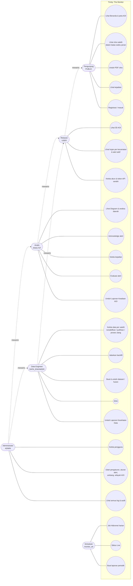
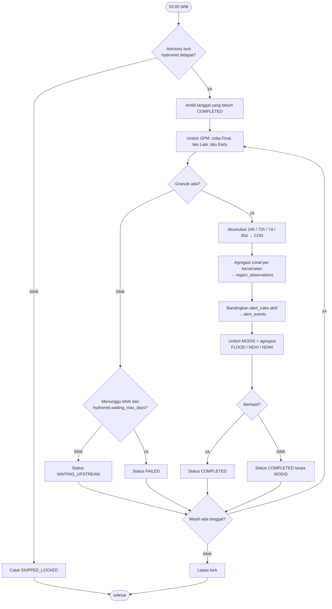
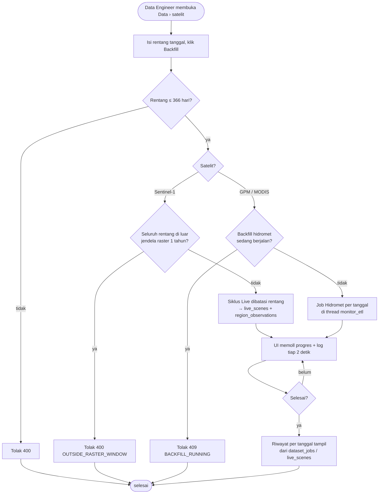
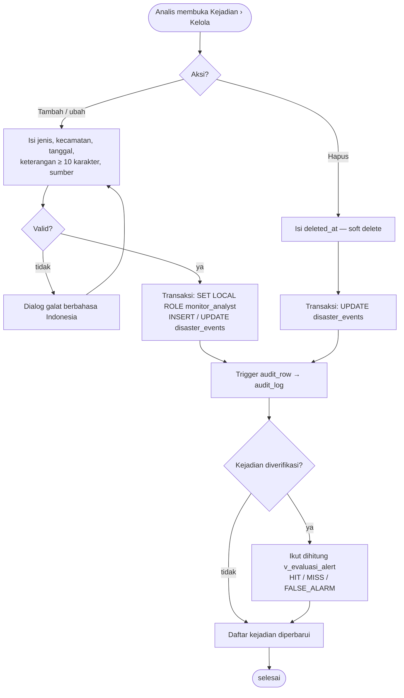

# INTERFACE.md — Trinity: The Monitor

Susunan halaman, hak akses per peran, endpoint API, dan kode galat. Berlaku
sejak **M56** (README §7): susunan halaman mengikuti rancangan pemilik proyek
(`DOCS/rancangan kasar.txt`, 7 Okt 2026). Dokumen ini mencatat kode yang
berjalan; bila berbeda, kode yang benar dan dokumen ini yang diperbaiki.

---

## 1. Peran

Hierarki (sama di API `api/deps.py` dan di PostgreSQL `monitor_security.sql`):

```
ADMIN ⊃ ANALYST       ⊃ USER ⊃ PUBLIC
ADMIN ⊃ DATA_ENGINEER ⊃ USER
```

| Peran | Label UI | Cara mendapat akun |
|---|---|---|
| `PUBLIC` | Pengunjung | Tanpa akun |
| `USER` | Relawan | **Registrasi mandiri** di `/daftar` (`POST /api/auth/register`) |
| `ANALYST` | Analis | Dibuat Administrator (`POST /api/admin/users`) |
| `DATA_ENGINEER` | Data Engineer | Dibuat Administrator |
| `ADMIN` | Administrator | Dibuat Administrator / `scripts/create_admin.py` |

Peran akun registrasi dikunci di fungsi DB `auth_register_user` (selalu `USER`);
endpoint tidak menerima pilihan peran.

---

## 2. Susunan Halaman

Aplikasi (`/` dan `/app`, satu berkas `web/app.html`) **terbuka untuk pengunjung**.
Menu disusun `web/js/app.js` dari kunci izin `GET /api/auth/session`; halaman
yang tidak diizinkan tidak tampil. Pengunjung yang membuka alamat halaman
ber-akun diantar ke `/masuk?next=…`.

| # | Halaman | Hash | Tab (berkas `pages/*.html` + `js/*.js`) |
|---|---|---|---|
| 0 | Masuk | `/masuk` | `login` — nama pengguna + kata sandi, panel manfaat akun Relawan |
| -0 | Registrasi | `/daftar` | `register` — email, nama pengguna, kata sandi, konfirmasi |
| 1 | Beranda | `#beranda` | `home` — 1.1 sambutan, 1.2 penjelasan, 1.3 kartu halaman per peran, 1.4 peta AOI + daftar kecamatan; alert hujan aktif untuk USER+; pilihan tema tampilan (Orbital 95 bawaan, Kertas Mint, Mika Pasir, Piksel Marun — M57) |
| 2 | 3D AOI | `#aoi-3d` | `terrain3d` — citra di atas relief DEM |
| 3 | Citra Satelit | `#citra/…` | `ringkasan` (`citra`), `sentinel-1` / `modis` / `gpm` (`citra-sat`, satelit dari `tab.source`), `laporan` (`citra-report`) |
| 4 | Forecast (dulu Diagram, M61) | `#forecast/…` | `terbaru` + `analisa-daerah` (`diagram`, mode dari `tab.mode`; setiap grafik garis + forecast 15 hari dengan sakelar di bawahnya), `evaluasi` (`analytics`; CH-01 tren per kecamatan dan CH-03 rerata hujan juga diberi forecast) |
| 5 | Kejadian | `#kejadian/…` | `lihat` (`disasters-view`), `kelola` (`disasters`) |
| 6 | Data | `#data/…` | `ringkasan` (`data-home`), `sentinel-1` / `gpm` / `modis` (`data-source`), `unduh` (`create-dataset`), `tersimpan` (`catalog`), `proses` (`process`), `eda` (`eda`) |
| 7 | Laporan | `#laporan/…` | `kesehatan-data` + `keadaan-aoi` (`reports`, jenis dari `tab.kind`) |
| 8 | Sistem | `#sistem/…` | `tentang` (`about`), `log` (`logs`), `akun` (`account`), `pengguna` (`admin`, kelompok `akses`), `pengaturan` (`admin`, kelompok `pengaturan`) |

Isi per halaman:

* **3.2–3.4 per satelit**: penjelasan satelit (lintasan, resolusi, informasi
  yang bisa diambil, keterbatasan), daftar tanggal dalam batas peran, gambar
  PNG (perbesar dengan lightbox), kalimat kondisi, tabel angka per band ×
  metrik, penjelasan + ambang tiap band, dan **perbandingan 2 tanggal**
  (gambar berdampingan + kolom selisih). Tab GPM untuk USER+ juga memuat
  "Hujan per kecamatan hari ini" (fragmen `statistics`, termasuk acknowledge
  alert untuk Analis).
* **3.5 Laporan PDF**: centang Ringkasan / Sentinel-1 / MODIS / GPM (satu,
  beberapa, atau semua), tanggal scene, pembanding opsional → satu PDF.
* **4.1 Keadaan terbaru**: semua band dalam satu grafik, satu warna per band,
  **satu titik per tanggal**. Titik per band = angka harian Job Hidromet (rerata
  kecamatan AOI); hari tanpa angka harian memakai rerata metrik scene Live
  (titik berbingkai, garis putus-putus); Sentinel-1 (VV, VH, WATER_PCT) juga
  rerata kecamatan, tetapi hanya pada tanggal lintasan (M58). Tiap garis
  diskalakan ke **rentang biasa** band itu (persentil 2–98 setahun, diperluas
  bila data keluar darinya), bukan ke min–maks jendela. Jendela bawaan 30 hari
  terakhir; bila tidak ada satu pun angka harian di dalamnya (backfill/Job
  Hidromet tertinggal) halaman otomatis menampilkan 30 hari s.d. angka harian
  terakhir dan mengatakannya. Diperiksa ulang tiap 5 menit (`updated_at`).
* **4.2 Analisa daerah**: pilih kecamatan + warna, rentang tanggal, band →
  satu grafik per band, termasuk band Sentinel-1 (M58). PDF memuat **semua**
  band per kecamatan.
* **6.2–6.4 per satelit**: daftar scene/granule (termasuk nonaktif),
  nonaktifkan dengan alasan / pulihkan / proses ulang, backfill dengan
  progres dan log yang terlihat langsung, riwayat per tanggal.
* **6.5 Unduh data**: wizard dataset (satelit, tanggal, tanpa fusion atau
  fusion `FULL_COVERAGE` / co-occurrence / hybrid); ZIP diunduh dari
  "Dataset tersimpan".
* **6.6 EDA**: per satelit dan rentang tanggal — statistik deskriptif,
  kekosongan terhadap sel yang diharapkan, histogram, pencilan (1,5 × IQR),
  korelasi Pearson berpasangan, kelengkapan per hari, metadata.
* **7 Laporan**: daftar mingguan/bulanan otomatis + "buat sendiri" untuk
  rentang bebas (≤ 366 hari, PDF langsung diunduh).
* **8.2 Log**: bagian mengikuti peran (lihat §3).

Alamat lama tetap hidup lewat `ALIASES` (awalan terpanjang): `#kondisi/citra`
→ `#citra/sentinel-1`, `#kondisi/kecamatan` → `#citra/gpm`, `#kondisi/relief`
→ `#aoi-3d`, `#diagram/…` → `#forecast/…` (M61), `#riwayat/grafik` → `#forecast/evaluasi`, `#riwayat/laporan` →
`#laporan`, `#pengaturan/…` → `#sistem/pengaturan`, `#pengaturan/akses` →
`#sistem/pengguna`, `#akun` → `#sistem/akun`, dst. Halaman publik lama
dialihkan 301: `/kondisi` → `/app#citra`, `/relief` → `/app#aoi-3d`.

---

## 3. Matriks Akses

### 3.1 Halaman

`●` penuh · `◐` terbatas · `—` tidak tampil

| Halaman / fitur | PUBLIC | USER | ANALYST | DATA_ENG | ADMIN |
|---|:-:|:-:|:-:|:-:|:-:|
| 0 Masuk, -0 Registrasi | ● | — | — | — | — |
| 1 Beranda | ● | ● | ● | ● | ● |
| 2 3D AOI | — | ● | ● | ● | ● |
| 3 Citra Satelit (termasuk PDF) | ◐ 30 hari | ◐ 365 hari | ● | ● | ● |
| 4 Forecast | — | — | ● | — | ● |
| 5.1 Lihat kejadian | ◐ 365 hari | ● | ● | ● | ● |
| 5.2 Kelola kejadian | — | — | ● | — | ● |
| 6 Data | — | — | — | ● | ● |
| 7.1 Laporan Kesehatan data | — | — | — | ● | ● |
| 7.2 Laporan Keadaan AOI | — | — | ● | — | ● |
| 8.1 Tentang | ● | ● | ● | ● | ● |
| 8.2 Log | — | — | ◐ halaman Kejadian | ◐ halaman Data | ● + masuk/registrasi, unduhan, audit |
| 8.3 Akun saya / Manajemen akun | — | ◐ milik sendiri | ◐ milik sendiri | ◐ milik sendiri | ● semua akun |
| 8.4 Pengaturan aplikasi | — | — | — | — | ● |

Batas waktu dihitung dari **hari ini**; scene Sentinel-1 terbaru tiap area
selalu terlihat walau lebih tua dari 30 hari. Scene yang berkasnya sudah
dihapus retensi (lebih tua dari 1 tahun, M58) tetap muncul di daftar tanggal
dengan angkanya, tanpa gambar.

### 3.2 Tiga lapis penegakan

1. UI menyembunyikan menu (kunci izin `GET /api/auth/session`).
2. `require_role(...)` di setiap route → 401 / 403 `ROLE_FORBIDDEN`.
3. Setiap request berjalan dalam satu transaksi `SET LOCAL ROLE monitor_<peran>`;
   GRANT, RLS, dan VIEW PostgreSQL menolak kueri yang lolos lapis 2 karena bug.

Batas waktu per peran ada di lapis 3:

| VIEW | Isi | Batas |
|---|---|---|
| `v_citra_scenes`, `v_citra_metrics` | scene Live + metrik per band | `pg_has_role(current_user, …)`: PUBLIC 30 hari, USER 365 hari, ANALYST/DATA_ENGINEER/ADMIN semua; scene terbaru selalu |
| `v_public_kejadian` | kejadian tanpa `source_reference`/`recorded_by`/`verified_by` | 365 hari, hanya untuk PUBLIC; USER+ membaca `disaster_events` |
| `v_log_data` | aktivitas unduhan/backfill/ubah scene + audit tabel katalog & scene | GRANT DATA_ENGINEER |
| `v_log_kejadian` | audit `disaster_events`/`disaster_types` + ekspor Excel kejadian | GRANT ANALYST |

Matriks GRANT lengkap diuji `tests/security/grant_matrix.sql`.

### 3.3 Kunci izin UI (`api/routes/auth.py` `PERMISSIONS`)

| Peran minimum | Kunci |
|---|---|
| PUBLIC | `home.view`, `citra.view`, `disasters.view`, `about.view`, `live.latest` |
| USER | `aoi3d.view`, `live.recent`, `hydromet.today`, `alerts.view`, `account.manage` |
| ANALYST | `alerts.acknowledge`, `analytics.view`, `diagram.view`, `disasters.manage`, `reports.hydromet`, `logs.disasters` |
| DATA_ENGINEER | `datasets.manage`, `eda.view`, `reports.datahealth`, `logs.data` |
| ADMIN | `admin.system`, `admin.accounts`, `logs.all` |

---

## 4. Endpoint API

Semua di bawah `/api`. Peran minimum tiap operasi juga tercantum di OpenAPI
(`x-min-role`, `/docs`) dan diuji per endpoint × peran di
`tests/test_rbac_api.py`. Bagian ini mendaftar endpoint yang ditambah atau
diubah M56; endpoint lain tidak berubah.

### 4.1 Autentikasi

| Metode | Path | Peran | Keterangan |
|---|---|---|---|
| GET | `/auth/session` | PUBLIC | `{authenticated, role_code, permissions, user}`; tidak pernah 401 |
| POST | `/auth/register` | PUBLIC | `{email, username, password, password_confirm}` → 201 + cookie sesi. 5 per IP per jam. Dicatat `REGISTER` |
| GET | `/auth/me` | USER | tidak berubah |

### 4.2 Citra Satelit (`api/routes/citra.py`)

| Metode | Path | Peran | Keterangan |
|---|---|---|---|
| GET | `/citra/summary?area_id=` | PUBLIC | rekap per satelit, batas peran (`window`) |
| GET | `/citra/sources/{s1\|modis\|gpm}` | PUBLIC | penjelasan satelit + band (warna, ambang) |
| GET | `/citra/areas/{id}/scenes?source=` | PUBLIC | tanggal dalam batas peran |
| GET | `/citra/areas/{id}/scenes/{tanggal}?source=` | PUBLIC | gambar, kalimat, metrik (`metric_label`, `metric_unit`) |
| GET | `/citra/areas/{id}/preview/{tanggal}/{key}.png` | PUBLIC | PNG; path dicari koneksi ETL setelah VIEW membuktikan scene terlihat |
| GET | `/citra/report.pdf?area_id&pages&date&compare` | PUBLIC, unduhan | PDF halaman pilihan; dicatat `DOWNLOAD_REPORT` |

### 4.3 Forecast, dulu Diagram (`api/routes/diagram.py`, ANALYST)

| Metode | Path | Keterangan |
|---|---|---|
| GET | `/diagram/bands` | band + penjelasan + warna + ambang, `last_obs_date` |
| GET | `/diagram/latest?days=30&end=` | satu titik per hari per band (`y` null bila kosong, `source` daily/scene), `range` rentang biasa 365 hari, `n_daily`, `last_obs_date`, `updated_at` |
| GET | `/diagram/regions?region_ids&bands&date_from&date_to` | ≤ 12 kecamatan, band per kecamatan saja, satu titik per hari |
| GET | `/diagram/report.pdf?region_ids&date_from&date_to&colors` | unduhan; semua band per kecamatan |
| GET | `/diagram/forecast?band&region_id&region_ids&end&horizon=15` | forecast satu band dari seluruh riwayatnya s.d. `end`: rerata AOI (tanpa `region_id`/`region_ids`, sumber sama dengan `/latest`), satu kecamatan, atau rerata harian ≤ 12 kecamatan (`region_ids`). `points[{x, mean, lo, hi}]` (pita 80%), `model`, `model_label`, `confidence` (rendah/sedang/tinggi), `backtest` (MAE per model, skill vs naive), `notes`. `stored` = true bila dari `band_forecasts` (+ `computed_at`), false bila dihitung di tempat (disimpan di memori sampai cap data band berubah) |

Forecast (`etl/band_forecast.py`, M61): lima model bersaing per deret (naive, SES, Holt teredam,
klimatologi, klimatologi + anomali AR(1)), dipilih lewat backtest setahun. Sejak M62 forecast rerata AOI
dan per kecamatan dihitung saat data baru masuk (`etl/forecast_store.py`) dan disimpan di
`band_forecasts`; endpoint membacanya bila masih berlaku dan hanya menghitung di tempat untuk rentang di
masa lalu atau rerata beberapa kecamatan. Rumus lengkap, jadwal, dan ukuran waktu: PIPELINE.md §14. UI meminta satu deret per request (3 paralel, antrean
`UI.forecastQueue` dipakai bersama tab Forecast dan Tren & evaluasi alert) dan menampilkan palang
progres + perkiraan sisa waktu; grafik data tampil lebih dulu.

Ambang dan teks band: `etl/band_catalog.py`, angka ambangnya dari
`etl.live_interpret.THRESHOLDS` (yang juga dipakai kalimat kondisi dan alert).

### 4.4 Kejadian (`api/routes/disasters.py`)

| Metode | Path | Peran | Keterangan |
|---|---|---|---|
| GET | `/disasters` | PUBLIC | pengunjung: `v_public_kejadian`, `window_days = 365`; USER+: semua, `window_days = null` |
| GET | `/disasters/{id}` | PUBLIC | `rain` (H-0..H-2) hanya untuk ANALYST+, selain itu `null` |
| POST, PUT, DELETE | `/disasters…` | ANALYST | tidak berubah (hapus = soft delete) |
| GET | `/disaster-types` | PUBLIC | sebelumnya USER |
| GET | `/regions` | PUBLIC | peta kecamatan AOI Beranda; sebelumnya USER |

### 4.5 Data (`api/routes/data.py`, DATA_ENGINEER)

| Metode | Path | Keterangan |
|---|---|---|
| GET | `/data/summary` | jumlah per satelit, rentang, hari angka per kecamatan, backfill terakhir |
| GET | `/data/activity` | pekerjaan dataset utama yang sedang jalan (M58): Job Hidromet (backfill/harian) dan siklus Live Sentinel-1 per area, dibaca dari basis data sehingga terlihat dari proses mana pun; dipakai banner Data › Ringkasan, Proses berjalan, dan Sistem › Pengaturan |
| GET | `/data/{s1\|modis\|gpm}/items` | daftar scene/granule termasuk nonaktif |
| PATCH | `/data/{src}/items/{id}` | `{is_valid, reason}`; alasan wajib saat menonaktifkan; dicatat `SCENE_UPDATE` |
| POST | `/data/{src}/items/{id}/reprocess` | proses ulang (sama dengan `/admin/scenes/…/reprocess`) |
| POST | `/data/{src}/backfill` | `{date_from, date_to}` ≤ 366 hari. S1 → siklus Live dibatasi rentang, mengisi dataset utama (M58); rentang yang seluruhnya > 1 tahun ditolak 400 `OUTSIDE_RASTER_WINDOW`; GPM → Job Hidromet tanpa MODIS; MODIS → tanggal tanpa angka MODIS (`hydromet_job.modis_missing_dates`). Satu backfill hidromet sekaligus (409 `BACKFILL_RUNNING`) |
| GET | `/data/{src}/backfill` | proses terakhir + riwayat per tanggal (`dataset_jobs`; S1: `live_scenes` + jumlah angka per kecamatan) |
| GET | `/data/backfill/runs/{id}?since=` | progres + baris log baru (dipoll UI tiap 2 detik) |
| GET | `/data/eda?source&date_from&date_to` | EDA (`etl/eda.py`) |

Log backfill (ketiga satelit) disimpan di memori (500 baris terakhir per jalan) dan
di `logs/backfill/backfill_<id>.log`; hasil per tanggal tetap di `dataset_jobs`.

### 4.6 Laporan & log

| Metode | Path | Peran | Keterangan |
|---|---|---|---|
| GET | `/reports/custom.pdf?kind&date_from&date_to` | USER + audiens | HYDROMET → ANALYST, DATAHEALTH → DATA_ENGINEER; ≤ 366 hari; dibangun koneksi ETL setelah cek audiens; tidak disimpan di `generated_reports` |
| GET | `/logs/data` | DATA_ENGINEER | `v_log_data` |
| GET | `/logs/kejadian` | ANALYST | `v_log_kejadian` |
| GET | `/admin/logs/login` | ADMIN | kini termasuk `REGISTER` |

### 4.7 Batas waktu endpoint lama

`/live/areas/{id}/card|preview` dan `/hydromet/*`: USER 365 hari (sebelumnya
30); ANALYST dan DATA_ENGINEER tanpa batas (sebelumnya ADMIN saja untuk
Live, ANALYST saja untuk hidromet).

---

## 5. Kode Galat

Format galat API: `{"detail": "…", "code": "…"}` (detail Bahasa Inggris, M21).
UI menerjemahkan setiap kode di `web/js/ui.js` `ERROR_TEXT`.

Kode spesifik: `NOT_AUTHENTICATED`, `SESSION_EXPIRED`, `ACCOUNT_INACTIVE`, `INVALID_CREDENTIALS`,
`ACCOUNT_LOCKED`, `ROLE_FORBIDDEN`, `DB_PERMISSION_DENIED`, `CSRF_HEADER_REQUIRED`, `TOKEN_INVALID`,
`TOKEN_REVOKED`, `TOKEN_EXPIRED`, `TOKEN_WRITE_FORBIDDEN`, `TOKEN_SCOPE_FORBIDDEN`, `RATE_LIMITED`,
`NOT_DATASET_OWNER`, `SCENE_OUT_OF_RANGE`, `DATE_OUT_OF_RANGE`, `SCENE_NOT_PUBLIC`, `PASSWORD_POLICY`,
`PASSWORD_MISMATCH`, `INVALID_OLD_PASSWORD`, `USERNAME_TAKEN`, `EMAIL_TAKEN`, `CANNOT_MODIFY_SELF`,
`TOKEN_ALREADY_REVOKED`, `INVALID_DATE_RANGE`, `ALERT_ALREADY_ACKED`, `THRESHOLD_REQUIRED`,
`RULE_CODE_TAKEN`, `TYPE_CODE_TAKEN`, `UNKNOWN_REFERENCE`, `INVALID_DISASTER`, `NOT_KECAMATAN`,
`AOI_EMPTY`, `INVALID_ROI`, `HYDROMET_NOT_READY`, `REPORT_AUDIENCE`, `INVALID_PERIOD`, `FILE_MISSING`,
`INVALID_SOURCE`, `INVALID_PAGES`, `INVALID_BAND`, `BACKFILL_RUNNING`, `OUTSIDE_RASTER_WINDOW`, `REASON_REQUIRED`,
`NOT_REPROCESSABLE`, `INVALID_THRESHOLD`, `INVALID_SETTING`, `ENTITY_FORBIDDEN`, `IMPORT_NOT_SUPPORTED`,
`INVALID_IMPORT_FILE`, `IMPORT_ROWS_INVALID`, `EMPTY_UPLOAD`, `UPLOAD_TOO_LARGE`.

| HTTP | Kode umum (bila route tidak memberi kode spesifik) |
|---|---|
| 400 | `BAD_REQUEST` |
| 401 | `NOT_AUTHENTICATED` |
| 403 | `ROLE_FORBIDDEN` |
| 404 | `NOT_FOUND` |
| 409 | `CONFLICT` |
| 422 | `VALIDATION_ERROR` |
| 429 | `RATE_LIMITED` |
| 500 | `INTERNAL_ERROR` |
| 503 | `SERVICE_UNAVAILABLE` |

---

## 6. Basis Data

Perubahan M56 ada di `monitor_schema.sql` / `monitor_security.sql` (database
baru) dan di `database/migrations/m56_susunan_halaman_v2.sql` (database yang
sudah berjalan; idempoten, tidak mengubah baris data):

* `users.email` (unik tanpa membedakan huruf besar) + fungsi `auth_register_user`;
* VIEW `v_public_kejadian`, `v_citra_scenes`, `v_citra_metrics`, `v_log_data`,
  `v_log_kejadian`; `v_log_login` ikut `REGISTER`;
* GRANT: PUBLIC baca VIEW di atas + `administrative_regions`, `disaster_types`,
  `satellite_sources`, `spectral_bands`; USER baca `disaster_events`;
  DATA_ENGINEER `UPDATE` `satellite_scenes`/`nasa_scenes` (soft delete), ADMIN
  mewarisinya.

```
python database/apply_schema.py --migrate m56_susunan_halaman_v2.sql
```

---

## 7. Pengujian

| Berkas | Isi |
|---|---|
| `tests/test_rbac_api.py` | setiap endpoint × peran (lapis 2), lapis 3 dengan pemeriksaan API dimatikan, token READ |
| `tests/security/grant_matrix.sql` | matriks GRANT + perilaku: batas waktu VIEW per peran, registrasi hanya lewat fungsi, log per halaman |
| `tests/test_auth.py` | registrasi (peran terkunci, duplikat, batas laju), `/auth/session` |
| `tests/test_citra_api.py` | batas waktu Citra per peran, isi per satelit, PDF |
| `tests/test_diagram_api.py` | semua band, analisa daerah, PDF, peran, forecast (endpoint AOI/kecamatan/rerata beberapa kecamatan, validasi, pemilihan model musiman, batas fisik, deret pendek) |
| `tests/test_data_api.py` | Data per satelit, backfill + log, EDA, log per halaman, laporan rentang bebas |
| `tests/test_web_ui.py` | susunan halaman, alias hash lama, fragmen + skrip, kode galat, aturan desain |

### 7.1 Hasil uji terakhir

Dijalankan 8 Oktober 2026 pada database `themonitor_dev` (PostgreSQL 18), di luar `tests/ui/` yang butuh browser:

```
venv\Scripts\python -m pytest --ignore=tests/ui --junitxml=DOCS/hasil_uji/pytest.xml
```

| Lulus | Gagal | Dilewati | Waktu |
|---|---|---|---|
| 1.140 | 0 | 2 | 2 menit 18 detik |

- Dua tes yang dilewati butuh shapefile COD-AB di `data/external/cod-ab-idn/` (`test_hydromet_aggregate::TestRegionsFromShapefile`).
- Matriks GRANT (`tests/security/grant_matrix.sql`) ikut dijalankan lewat `tests/security/test_grant_matrix.py`.
- Belum dijalankan: `tests/ui/` (browser headless) dan `tests/recovery/*.sh`.
- Artefak: `DOCS/hasil_uji/pytest.xml` (JUnit) dan `pytest_output.txt`.

Run pertama menemukan dua kegagalan yang langsung diperbaiki. Pertama, kode galat `OUTSIDE_RASTER_WINDOW` belum punya terjemahan di `web/js/ui.js`. Kedua, pemeriksa cakupan CSS tema di `tests/test_web_ui.py` memecah selektor pada koma di dalam `:is()`.

---

## 8. Keputusan yang diambil saat implementasi

Jawaban bawaan atas pertanyaan draf (§7 versi draf), dipakai karena eksekusi
diminta tanpa jawaban terpisah. Ubah di sini dan di kode bila berbeda dari
keinginan pemilik proyek.

| # | Pertanyaan | Keputusan |
|---|---|---|
| Q1 | Fitur yang tidak disebut rancangan | Hujan per kecamatan masuk Citra › GPM; alert aktif di Beranda; Tren & evaluasi alert jadi tab ketiga Diagram |
| Q2 | Dasar "30 hari / 1 tahun" | Dihitung dari hari ini; scene terbaru selalu tampil |
| Q3 | PDF Citra untuk pengunjung | Boleh, dengan batas 30 hari yang sama |
| Q4 | Manajemen akun | Semua peran login: akun sendiri; ADMIN: semua akun |
| Q5 | Verifikasi email | Tidak; akun langsung aktif, dibatasi 5 registrasi per IP per jam |
| Q6 | "Hapus data" di halaman Data | Soft delete (nonaktifkan + alasan, bisa dipulihkan), sesuai M23/M24 |
| Q7 | Data Engineer melihat Diagram | Tidak, sesuai rancangan |

---

## 9. Pemodelan Sistem (UML)

Tahap "Pemodelan Sistem" SKRIPSI.txt. Diagram ditulis dalam Mermaid (render di VS Code atau
mermaid.live). Class diagram tidak dibuat terpisah: struktur data sudah digambarkan ERD fisik
`DOCS/generated/erd_physical.mmd` (DATABASE.md §2.6). Diagram mengikuti kode; bila berbeda, kode yang benar.

### 9.1 Use case

Mermaid tidak punya notasi use case, jadi aktor digambar sebagai node kotak-bulat dan use case sebagai
elips. Garis putus-putus = pewarisan peran (hierarki §1): peran di atas mewarisi semua use case peran di
bawahnya.



Batas akses tiap use case: §3.1. Penegakannya di basis data: DATABASE.md §8.

### 9.2 Activity: Job Hidromet harian → alert

`etl/hydromet_job.py`, PIPELINE.md §3.



### 9.3 Activity: backfill oleh Data Engineer

`api/routes/data.py`, `etl/backfill_runs.py`.



### 9.4 Activity: kelola kejadian oleh Analis

`api/routes/disasters.py`, `etl/disasters.py`.


